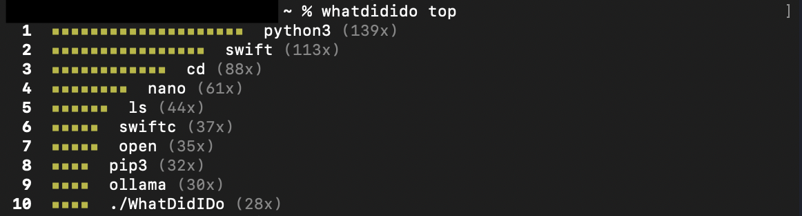

# whatdidido

A pretty wrapper for your shell history. Answers the questions you actually ask yourself at the terminal.



```
whatdidido recent
whatdidido top
whatdidido for git
```

---

## Installation

### Requirements

- Swift 5.9+
- [swift-argument-parser](https://github.com/apple/swift-argument-parser) 1.3.0+

### Homebrew (recommended)

```bash
brew tap link-coder100788/whatdidido
brew install whatdidido
```

Or in a single command:

```bash
brew install link-coder100788/whatdidido/whatdidido
```

To update:

```bash
brew update
brew upgrade whatdidido
```

To uninstall:

```bash
brew uninstall whatdidido
brew untap link-coder100788/whatdidido
```

### Make

```bash
git clone https://github.com/link-coder100788/WhatDidIDo
cd WhatDidIDo
make install
```

To install to a different prefix (e.g. `~/.local`):

```bash
make install PREFIX=~/.local
```

To uninstall:

```bash
make uninstall
```

### Manual (Swift Package Manager)

```bash
swift build -c release
cp .build/release/whatdidido /usr/local/bin/whatdidido
```

### Package.swift

```swift
dependencies: [
    .package(url: "https://github.com/apple/swift-argument-parser", from: "1.3.0")
],
targets: [
    .executableTarget(name: "whatdidido", dependencies: [
        .product(name: "ArgumentParser", package: "swift-argument-parser")
    ])
]
```

---

## Supported Shells & Platforms

| Shell | macOS | Linux | Windows |
|---|---|---|---|
| zsh | ✔ | ✔ | — |
| bash | ✔ | ✔ | — |
| fish | ✔ | ✔ | — |
| PowerShell | — | ✔ | ✔ |

Shell and OS are **auto-detected** from your environment — you rarely need to pass `--shell` or `--os` manually.

---

## Commands

### `recent` — What did I just do?

Shows commands from your current session (since the last `clear`/`exit`), or the last N commands.

```bash
whatdidido recent
whatdidido recent -c 30
```

| Flag | Default | Description |
|---|---|---|
| `-c, --count` | `20` | Number of commands to show |

This is the **default command** — running bare `whatdidido` is the same as `whatdidido recent`.

---

### `dirs` — Where have I been?

Shows your most recently visited directories from `cd` history, deduplicated.

```bash
whatdidido dirs
whatdidido dirs -l 5
```

| Flag | Default | Description |
|---|---|---|
| `-l, --limit` | `10` | Number of directories to show |

---

### `top` — What do I type most?

Ranks your most-used commands by frequency with a visual bar chart.

```bash
whatdidido top
whatdidido top -c 20
```

| Flag | Default | Description |
|---|---|---|
| `-c, --count` | `10` | How many top commands to show |

---

### `search` — Did I already do this?

Searches your full history for a keyword or phrase, with highlighted matches and line numbers.

```bash
whatdidido search "docker run"
whatdidido search kubectl
```

| Argument | Description |
|---|---|
| `query` | The term to search for (case-insensitive) |

---

### `for` — How do I use X again?

Pulls all commands for a specific tool — great for recalling flags and patterns you've used before.

```bash
whatdidido for git
whatdidido for docker -l 30
whatdidido for kubectl
```

| Argument/Flag | Default | Description |
|---|---|---|
| `tool` | — | The tool name to filter by (e.g. `git`, `npm`, `kubectl`) |
| `-l, --limit` | `20` | Max results to show |

---

### `summary` — What was I working on?

A de-duplicated digest of recent activity. Good for standup notes or end-of-day recaps.

```bash
whatdidido summary
whatdidido summary --last 100
```

| Flag | Default | Description |
|---|---|---|
| `--last` | `50` | How many recent commands to summarize |

---

### `check` — Have I run this before?

Returns a simple yes/no on whether a command exists in your history.

```bash
whatdidido check "make build"
whatdidido check "rm -rf dist" --exact
```

| Argument/Flag | Default | Description |
|---|---|---|
| `command` | — | The command to check for |
| `--exact` | `false` | Require an exact match instead of prefix match |

---

### `after` — What did I do next?

Shows the commands that followed a match — useful for reconstructing multi-step workflows you half-remember.

```bash
whatdidido after "git clone"
whatdidido after "brew install" -w 8
```

| Argument/Flag | Default | Description |
|---|---|---|
| `query` | — | The command or keyword to look up |
| `-w, --window` | `5` | How many subsequent commands to show |

---

## Configuration

### `config set` — Set a value

```bash
# Point to a custom history file
whatdidido config set --path ~/.config/my_custom_history

# Disable color output (e.g. for piping to files)
whatdidido config set --color false
```

### `config show` — Print current config

```bash
whatdidido config show
# color:  true
# path:   (default — auto-detected from shell)
```

### `config reset` — Restore defaults

```bash
whatdidido config reset
```

Config is stored at `~/.whatdidido/config.plist` and created automatically on first use.

---

## Global Flags

These flags are available on every command:

| Flag | Default | Description |
|---|---|---|
| `-s, --shell` | auto-detected | Override shell (`zsh`, `bash`, `fish`, `powershell`) |
| `-o, --os` | auto-detected | Override OS (`macos`, `linux`, `windows`) |

---

## Tips

**Pipe to grep for further filtering:**
```bash
whatdidido for git | grep "push"
```

**Disable color when saving output:**
```bash
whatdidido config set --color false
whatdidido summary > standup.txt
whatdidido config set --color true
```

**Use a non-standard history file:**
```bash
whatdidido config set --path /Volumes/external/.zsh_history
```

Or pass it per-command with a symlink if you juggle multiple profiles.

---

## Make targets

| Target | Description |
|---|---|
| `make` / `make build` | Debug build |
| `make release` | Optimised release build |
| `make install` | Release build + install to `/usr/local/bin` |
| `make install PREFIX=~/.local` | Install to a custom prefix |
| `make uninstall` | Remove the installed binary |
| `make clean` | Clean build artefacts |
| `make test` | Run the test suite |

---

## License

MIT
